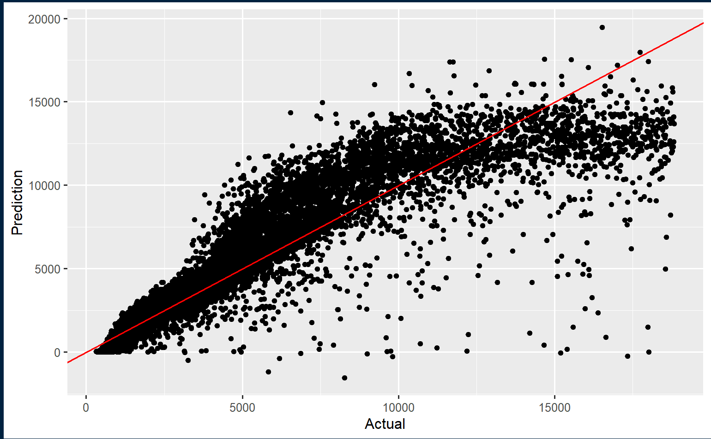

Tensor for the people
================
Yancheng Li
2024-02-09

This package introduces a novel formula syntax for tensor. This package
provides an extension for Karl Rohe’s
[longpca](https://github.com/karlrohe/longpca).

#### Install

You can install this `longtensor` R package through \`devtools’:

``` r
install.packages("devtools")
devtools::install_github("Yancheng-Li-Stat/longtensor")
```

### Define your model

Use nycflights13 as an example:

``` r
library(nycflights13)

head(flights)
```

    ## # A tibble: 6 × 19
    ##    year month   day dep_time sched_dep_time dep_delay arr_time sched_arr_time
    ##   <int> <int> <int>    <int>          <int>     <dbl>    <int>          <int>
    ## 1  2013     1     1      517            515         2      830            819
    ## 2  2013     1     1      533            529         4      850            830
    ## 3  2013     1     1      542            540         2      923            850
    ## 4  2013     1     1      544            545        -1     1004           1022
    ## 5  2013     1     1      554            600        -6      812            837
    ## 6  2013     1     1      554            558        -4      740            728
    ## # ℹ 11 more variables: arr_delay <dbl>, carrier <chr>, flight <int>,
    ## #   tailnum <chr>, origin <chr>, dest <chr>, air_time <dbl>, distance <dbl>,
    ## #   hour <dbl>, minute <dbl>, time_hour <dttm>

Suppose you want to create a model to study how dates, origin and dest
influence carrier:

``` r
formula = carrier ~ (month & day) * origin * dest
```

Make an instance using class make_interaction_model:

``` r
im = make_interaction_model(formula, flights, duplicates = 'most')
im
```

    ## $cleaned_tibble
    ## # A tibble: 63,832 × 5
    ##    month   day origin dest  carrier
    ##    <int> <int> <chr>  <chr> <chr>  
    ##  1     1     1 EWR    IAH   UA     
    ##  2     1     1 LGA    IAH   UA     
    ##  3     1     1 JFK    MIA   AA     
    ##  4     1     1 JFK    BQN   B6     
    ##  5     1     1 LGA    ATL   DL     
    ##  6     1     1 EWR    ORD   UA     
    ##  7     1     1 EWR    FLL   UA     
    ##  8     1     1 LGA    IAD   EV     
    ##  9     1     1 JFK    MCO   B6     
    ## 10     1     1 LGA    ORD   AA     
    ## # ℹ 63,822 more rows
    ## 
    ## $interation_tibble
    ## # A tibble: 63,832 × 4
    ##    origin  dest carrier month_day
    ##     <int> <int> <chr>       <int>
    ##  1      1     1 UA              1
    ##  2      2     1 UA              1
    ##  3      3     2 AA              1
    ##  4      3     3 B6              1
    ##  5      2     4 DL              1
    ##  6      1     5 UA              1
    ##  7      1     6 UA              1
    ##  8      2     7 EV              1
    ##  9      3     8 B6              1
    ## 10      2     5 AA              1
    ## # ℹ 63,822 more rows
    ## 
    ## $features_universe
    ## $features_universe$month_day
    ## # A tibble: 372 × 3
    ##    month   day index
    ##    <int> <int> <int>
    ##  1     1     1     1
    ##  2    10     1     2
    ##  3    11     1     3
    ##  4    12     1     4
    ##  5     2     1     5
    ##  6     3     1     6
    ##  7     4     1     7
    ##  8     5     1     8
    ##  9     6     1     9
    ## 10     7     1    10
    ## # ℹ 362 more rows
    ## 
    ## $features_universe$origin
    ## # A tibble: 3 × 2
    ##   origin index
    ##   <fct>  <int>
    ## 1 EWR        1
    ## 2 LGA        2
    ## 3 JFK        3
    ## 
    ## $features_universe$dest
    ## # A tibble: 105 × 2
    ##    dest  index
    ##    <fct> <int>
    ##  1 IAH       1
    ##  2 MIA       2
    ##  3 BQN       3
    ##  4 ATL       4
    ##  5 ORD       5
    ##  6 FLL       6
    ##  7 IAD       7
    ##  8 MCO       8
    ##  9 PBI       9
    ## 10 TPA      10
    ## # ℹ 95 more rows
    ## 
    ## 
    ## $features_unfolding
    ## $features_unfolding$month_day
    ## # A tibble: 315 × 3
    ##    origin  dest index
    ##     <int> <int> <int>
    ##  1      1     1     1
    ##  2      2     1     2
    ##  3      3     1     3
    ##  4      1     2     4
    ##  5      2     2     5
    ##  6      3     2     6
    ##  7      1     3     7
    ##  8      2     3     8
    ##  9      3     3     9
    ## 10      1     4    10
    ## # ℹ 305 more rows
    ## 
    ## $features_unfolding$origin
    ## # A tibble: 38,325 × 3
    ##     dest month_day index
    ##    <int>     <int> <int>
    ##  1     1         1     1
    ##  2     2         1     2
    ##  3     3         1     3
    ##  4     4         1     4
    ##  5     5         1     5
    ##  6     6         1     6
    ##  7     7         1     7
    ##  8     8         1     8
    ##  9     9         1     9
    ## 10    10         1    10
    ## # ℹ 38,315 more rows
    ## 
    ## $features_unfolding$dest
    ## # A tibble: 1,095 × 3
    ##    origin month_day index
    ##     <int>     <int> <int>
    ##  1      1         1     1
    ##  2      2         1     2
    ##  3      3         1     3
    ##  4      1        13     4
    ##  5      2        13     5
    ##  6      3        13     6
    ##  7      1        25     7
    ##  8      2        25     8
    ##  9      3        25     9
    ## 10      1        37    10
    ## # ℹ 1,085 more rows
    ## 
    ## 
    ## $settings
    ## $settings$fo
    ## carrier ~ (month & day) * origin * dest
    ## 
    ## $settings$data_prefix
    ## NULL
    ## 
    ## $settings$outcome_aggregation
    ## [1] "most"
    ## 
    ## $settings$target
    ## [1] "carrier"
    ## 
    ## $settings$features
    ## $settings$features[[1]]
    ## [1] "month" "day"  
    ## 
    ## $settings$features[[2]]
    ## [1] "origin"
    ## 
    ## $settings$features[[3]]
    ## [1] "dest"
    ## 
    ## 
    ## 
    ## attr(,"class")
    ## [1] "interaction_model"

cleaned_tibble a preprocessed tibble to extract the key columns from the
original (huge) tibble, duplicates is either ‘most’, ‘add’, or ‘average’
to handle the exact same rows in terms of features. interaction_tibble
specifies a tensor using only index, and the correspondence between
index and categories are stored in

### Few features, many categories

Let’s consider the case that there are 3 features, and each feature has
hundreds of categories/distinct values.

Analyze the flight data from \[US Bureau of Transportation Statistics\]
(<https://www.transtats.bts.gov/DatabaseInfo.asp?QO_VQ=EEE&DB_URL=>,).

Three features are airlines, airports (start), and airports
(destination).

Use Karl’s longpca or elbow method of Zhu and Ghodsi (2006) to choose
the embedding dimensions. (Mu Zhu and Ali Ghodsi. Automatic
dimensionality selection from the scree plot via the use of profile
likelihood. Computational Statistics & Data Analysis, 51(2):918–930,
November 2006.)

To be completed…

### Many features, few categories

Let’s consider the case that there are many features. Note that in this
case, we cannot have too many categories/distinct values for each
feature, as it would explode the computer memory. For example, consider
the size of the core tensor when there are 32 features. Suppose we
choose the smallest embedding dimension 2. Then the core tensor, which
is not sparse, is a 32-order tensor with 2^32 numbers. Each number takes
8 bytes, then the total RAM required to just store the core tensor is 8
\* 2^32 bytes = 2^15 MB = 64 GB.

For example, consider a dataset from OpenML:
[diamonds](https://www.openml.org/search?type=data&sort=runs&id=42225&status=active)

``` r
dataset <- getOMLDataSet(data.id = 42225)
```

    ## Downloading from 'http://www.openml.org/api/v1/data/42225' to 'C:\Users\liyan\AppData\Local\Temp\Rtmpmq3Zn1\cache\datasets\42225\description.xml'.

    ## Downloading from 'https://api.openml.org/data/v1/download/21792853/diamonds.arff' to 'C:\Users\liyan\AppData\Local\Temp\Rtmpmq3Zn1\cache\datasets\42225\dataset.arff'

``` r
diamonds <- as_tibble(dataset$data)

head(diamonds)
```

    ## # A tibble: 6 × 10
    ##   carat cut       color clarity depth table price     x     y     z
    ##   <dbl> <fct>     <fct> <fct>   <dbl> <dbl> <dbl> <dbl> <dbl> <dbl>
    ## 1  0.23 Ideal     E     SI2      61.5    55   326  3.95  3.98  2.43
    ## 2  0.21 Premium   E     SI1      59.8    61   326  3.89  3.84  2.31
    ## 3  0.23 Good      E     VS1      56.9    65   327  4.05  4.07  2.31
    ## 4  0.29 Premium   I     VS2      62.4    58   334  4.2   4.23  2.63
    ## 5  0.31 Good      J     SI2      63.3    58   335  4.34  4.35  2.75
    ## 6  0.24 Very Good J     VVS2     62.8    57   336  3.94  3.96  2.48

We need to exclude some columns that are dependent:

Need to come up with a diagnoistic step here. To be completed…

Divide distinct values into categories:

(the following part should be put inside a function)

``` r
diamonds_reduced <- diamonds %>%
  mutate(table = ntile(z, 10)) %>%
  mutate(x = ntile(z, 10)) %>%
  mutate(y = ntile(z, 8)) %>%
  mutate(z = ntile(z, 8))
```

``` r
set.seed(123)  # for reproducibility
diamonds_split <- initial_split(diamonds_reduced, prop = 0.7)

# Create training and test sets
train_set <- training(diamonds_split)
test_set <- testing(diamonds_split)
```

Create an interaction_model instance:

``` r
diamonds_model = make_interaction_model(price~cut+color+clarity+table+x+y+z, train_set, duplicates = 'average')
diamonds_model
```

    ## $cleaned_tibble
    ## # A tibble: 3,115 × 8
    ##    cut       color clarity table     x     y     z price
    ##    <fct>     <fct> <fct>   <int> <int> <int> <int> <dbl>
    ##  1 Ideal     I     VS1         6     6     5     5 2662.
    ##  2 Ideal     G     VS1         5     5     4     4 2137.
    ##  3 Ideal     D     VS1         1     1     1     1  734.
    ##  4 Ideal     H     VVS1        2     2     1     1  727.
    ##  5 Ideal     E     IF          1     1     1     1  995.
    ##  6 Good      E     SI1         6     6     5     5 3114.
    ##  7 Very Good D     VS2         4     4     4     4 1803.
    ##  8 Good      H     SI1         6     6     5     5 2572.
    ##  9 Ideal     E     VS1         3     3     3     3 1093.
    ## 10 Very Good I     SI1         8     8     6     6 4252.
    ## # ℹ 3,105 more rows
    ## 
    ## $interation_tibble
    ## # A tibble: 3,115 × 8
    ##      cut color clarity table     x     y     z price
    ##    <int> <int>   <int> <int> <int> <int> <int> <dbl>
    ##  1     1     1       1     1     1     1     1 2662.
    ##  2     1     2       1     2     2     2     2 2137.
    ##  3     1     3       1     3     3     3     3  734.
    ##  4     1     4       2     4     4     3     3  727.
    ##  5     1     5       3     3     3     3     3  995.
    ##  6     2     5       4     1     1     1     1 3114.
    ##  7     3     3       5     5     5     2     2 1803.
    ##  8     2     4       4     1     1     1     1 2572.
    ##  9     1     5       1     6     6     4     4 1093.
    ## 10     3     1       4     7     7     5     5 4252.
    ## # ℹ 3,105 more rows
    ## 
    ## $features_universe
    ## $features_universe$cut
    ## # A tibble: 5 × 2
    ##   cut       index
    ##   <fct>     <int>
    ## 1 Ideal         1
    ## 2 Good          2
    ## 3 Very Good     3
    ## 4 Premium       4
    ## 5 Fair          5
    ## 
    ## $features_universe$color
    ## # A tibble: 7 × 2
    ##   color index
    ##   <fct> <int>
    ## 1 I         1
    ## 2 G         2
    ## 3 D         3
    ## 4 H         4
    ## 5 E         5
    ## 6 F         6
    ## 7 J         7
    ## 
    ## $features_universe$clarity
    ## # A tibble: 8 × 2
    ##   clarity index
    ##   <fct>   <int>
    ## 1 VS1         1
    ## 2 VVS1        2
    ## 3 IF          3
    ## 4 SI1         4
    ## 5 VS2         5
    ## 6 VVS2        6
    ## 7 SI2         7
    ## 8 I1          8
    ## 
    ## $features_universe$table
    ## # A tibble: 10 × 2
    ##    table index
    ##    <int> <int>
    ##  1     6     1
    ##  2     5     2
    ##  3     1     3
    ##  4     2     4
    ##  5     4     5
    ##  6     3     6
    ##  7     8     7
    ##  8     7     8
    ##  9    10     9
    ## 10     9    10
    ## 
    ## $features_universe$x
    ## # A tibble: 10 × 2
    ##        x index
    ##    <int> <int>
    ##  1     6     1
    ##  2     5     2
    ##  3     1     3
    ##  4     2     4
    ##  5     4     5
    ##  6     3     6
    ##  7     8     7
    ##  8     7     8
    ##  9    10     9
    ## 10     9    10
    ## 
    ## $features_universe$y
    ## # A tibble: 8 × 2
    ##       y index
    ##   <int> <int>
    ## 1     5     1
    ## 2     4     2
    ## 3     1     3
    ## 4     3     4
    ## 5     6     5
    ## 6     2     6
    ## 7     8     7
    ## 8     7     8
    ## 
    ## $features_universe$z
    ## # A tibble: 8 × 2
    ##       z index
    ##   <int> <int>
    ## 1     5     1
    ## 2     4     2
    ## 3     1     3
    ## 4     3     4
    ## 5     6     5
    ## 6     2     6
    ## 7     8     7
    ## 8     7     8
    ## 
    ## 
    ## $features_unfolding
    ## $features_unfolding$cut
    ## # A tibble: 358,400 × 7
    ##    color clarity table     x     y     z index
    ##    <int>   <int> <int> <int> <int> <int> <int>
    ##  1     1       1     1     1     1     1     1
    ##  2     2       1     1     1     1     1     2
    ##  3     3       1     1     1     1     1     3
    ##  4     4       1     1     1     1     1     4
    ##  5     5       1     1     1     1     1     5
    ##  6     6       1     1     1     1     1     6
    ##  7     7       1     1     1     1     1     7
    ##  8     1       2     1     1     1     1     8
    ##  9     2       2     1     1     1     1     9
    ## 10     3       2     1     1     1     1    10
    ## # ℹ 358,390 more rows
    ## 
    ## $features_unfolding$color
    ## # A tibble: 256,000 × 7
    ##      cut clarity table     x     y     z index
    ##    <int>   <int> <int> <int> <int> <int> <int>
    ##  1     1       1     1     1     1     1     1
    ##  2     2       1     1     1     1     1     2
    ##  3     3       1     1     1     1     1     3
    ##  4     4       1     1     1     1     1     4
    ##  5     5       1     1     1     1     1     5
    ##  6     1       2     1     1     1     1     6
    ##  7     2       2     1     1     1     1     7
    ##  8     3       2     1     1     1     1     8
    ##  9     4       2     1     1     1     1     9
    ## 10     5       2     1     1     1     1    10
    ## # ℹ 255,990 more rows
    ## 
    ## $features_unfolding$clarity
    ## # A tibble: 224,000 × 7
    ##      cut color table     x     y     z index
    ##    <int> <int> <int> <int> <int> <int> <int>
    ##  1     1     1     1     1     1     1     1
    ##  2     2     1     1     1     1     1     2
    ##  3     3     1     1     1     1     1     3
    ##  4     4     1     1     1     1     1     4
    ##  5     5     1     1     1     1     1     5
    ##  6     1     2     1     1     1     1     6
    ##  7     2     2     1     1     1     1     7
    ##  8     3     2     1     1     1     1     8
    ##  9     4     2     1     1     1     1     9
    ## 10     5     2     1     1     1     1    10
    ## # ℹ 223,990 more rows
    ## 
    ## $features_unfolding$table
    ## # A tibble: 179,200 × 7
    ##      cut color clarity     x     y     z index
    ##    <int> <int>   <int> <int> <int> <int> <int>
    ##  1     1     1       1     1     1     1     1
    ##  2     2     1       1     1     1     1     2
    ##  3     3     1       1     1     1     1     3
    ##  4     4     1       1     1     1     1     4
    ##  5     5     1       1     1     1     1     5
    ##  6     1     2       1     1     1     1     6
    ##  7     2     2       1     1     1     1     7
    ##  8     3     2       1     1     1     1     8
    ##  9     4     2       1     1     1     1     9
    ## 10     5     2       1     1     1     1    10
    ## # ℹ 179,190 more rows
    ## 
    ## $features_unfolding$x
    ## # A tibble: 179,200 × 7
    ##      cut color clarity table     y     z index
    ##    <int> <int>   <int> <int> <int> <int> <int>
    ##  1     1     1       1     1     1     1     1
    ##  2     2     1       1     1     1     1     2
    ##  3     3     1       1     1     1     1     3
    ##  4     4     1       1     1     1     1     4
    ##  5     5     1       1     1     1     1     5
    ##  6     1     2       1     1     1     1     6
    ##  7     2     2       1     1     1     1     7
    ##  8     3     2       1     1     1     1     8
    ##  9     4     2       1     1     1     1     9
    ## 10     5     2       1     1     1     1    10
    ## # ℹ 179,190 more rows
    ## 
    ## $features_unfolding$y
    ## # A tibble: 224,000 × 7
    ##      cut color clarity table     x     z index
    ##    <int> <int>   <int> <int> <int> <int> <int>
    ##  1     1     1       1     1     1     1     1
    ##  2     2     1       1     1     1     1     2
    ##  3     3     1       1     1     1     1     3
    ##  4     4     1       1     1     1     1     4
    ##  5     5     1       1     1     1     1     5
    ##  6     1     2       1     1     1     1     6
    ##  7     2     2       1     1     1     1     7
    ##  8     3     2       1     1     1     1     8
    ##  9     4     2       1     1     1     1     9
    ## 10     5     2       1     1     1     1    10
    ## # ℹ 223,990 more rows
    ## 
    ## $features_unfolding$z
    ## # A tibble: 224,000 × 7
    ##      cut color clarity table     x     y index
    ##    <int> <int>   <int> <int> <int> <int> <int>
    ##  1     1     1       1     1     1     1     1
    ##  2     2     1       1     1     1     1     2
    ##  3     3     1       1     1     1     1     3
    ##  4     4     1       1     1     1     1     4
    ##  5     5     1       1     1     1     1     5
    ##  6     1     2       1     1     1     1     6
    ##  7     2     2       1     1     1     1     7
    ##  8     3     2       1     1     1     1     8
    ##  9     4     2       1     1     1     1     9
    ## 10     5     2       1     1     1     1    10
    ## # ℹ 223,990 more rows
    ## 
    ## 
    ## $settings
    ## $settings$fo
    ## price ~ cut + color + clarity + table + x + y + z
    ## 
    ## $settings$data_prefix
    ## NULL
    ## 
    ## $settings$outcome_aggregation
    ## [1] "average"
    ## 
    ## $settings$target
    ## [1] "price"
    ## 
    ## $settings$features
    ## $settings$features[[1]]
    ## [1] "cut"
    ## 
    ## $settings$features[[2]]
    ## [1] "color"
    ## 
    ## $settings$features[[3]]
    ## [1] "clarity"
    ## 
    ## $settings$features[[4]]
    ## [1] "table"
    ## 
    ## $settings$features[[5]]
    ## [1] "x"
    ## 
    ## $settings$features[[6]]
    ## [1] "y"
    ## 
    ## $settings$features[[7]]
    ## [1] "z"
    ## 
    ## 
    ## 
    ## attr(,"class")
    ## [1] "interaction_model"

use embed function:

``` r
embed(diamonds_model, c(4,6,7,7,7,6,6))
```

    ## [1] "Initializing cut"
    ## [1] "Initializing color"
    ## [1] "Initializing clarity"
    ## [1] "Initializing table"
    ## [1] "Initializing x"
    ## [1] "Initializing y"
    ## [1] "Initializing z"
    ## [1] "Iteration 1 completed. Distance is 754535.184019121"
    ## [1] "Iteration 2 completed. Distance is 165469.848921897"
    ## [1] "Iteration 3 completed. Distance is 586.118877541972"
    ## [1] "Iteration 4 completed. Distance is 0.924191602854989"
    ## [1] "Iteration 5 completed. Distance is 6.74262949149124"
    ## [1] "Iteration 6 completed. Distance is 1.08038647100329"
    ## [1] "Iteration 7 completed. Distance is 0.200851976987906"
    ## [1] "Iteration 8 completed. Distance is 0.0366788661340252"
    ## [1] "Iteration 9 completed. Distance is 0.00667500519193709"
    ## [1] "Iteration 10 completed. Distance is 0.0012134964345023"
    ## [1] "Iteration 11 completed. Distance is 0.000220547313801944"

    ## $cut
    ##         cut      cut_1      cut_2      cut_3       cut_4
    ## 1      Fair -0.2489130  0.6477435 -0.3643415 -0.07440402
    ## 2      Good -0.3709057  0.6025253  0.1796393 -0.04502413
    ## 3     Ideal -0.5311119 -0.3594143 -0.1579603 -0.75057302
    ## 4   Premium -0.5096080 -0.1018998  0.7330302  0.24506933
    ## 5 Very Good -0.5086169 -0.2789794 -0.5222071  0.60746855
    ## 
    ## $color
    ##   color    color_1     color_2    color_3      color_4     color_5     color_6
    ## 1     D -0.4119480  0.67048982 -0.4225750  0.438149132 -0.01237794  0.09579663
    ## 2     E -0.4213987  0.35557463  0.2430548 -0.672255526 -0.34029206 -0.23452744
    ## 3     F -0.4408077 -0.08641642  0.7631748  0.424075086  0.01699635  0.16600901
    ## 4     G -0.4228685 -0.13914913 -0.1611998 -0.367706370  0.71075420  0.28836047
    ## 5     H -0.3565350 -0.34826619 -0.1715405  0.202507435  0.15311615 -0.79989016
    ## 6     I -0.2972363 -0.41295162 -0.2219007 -0.005561412 -0.26619387  0.41909543
    ## 7     J -0.2532316 -0.32459425 -0.2743492  0.003162690 -0.53318285  0.09820324
    ## 
    ## $clarity
    ##   clarity  clarity_1  clarity_2   clarity_3   clarity_4   clarity_5
    ## 1      I1 -0.1606089 -0.1050400 -0.04029428  0.11337443  0.07957686
    ## 2      IF -0.2559980  0.6098011 -0.73899921  0.07283017  0.10196120
    ## 3     SI1 -0.3857151 -0.2725272 -0.01130686  0.10668766  0.36372138
    ## 4     SI2 -0.3410790 -0.2652234 -0.04748159  0.13930393  0.28518618
    ## 5     VS1 -0.4375304 -0.2075034 -0.13156724  0.02354478 -0.85321108
    ## 6     VS2 -0.4404333 -0.2669717 -0.03947648  0.11903782  0.17834173
    ## 7    VVS1 -0.3059563  0.5488338  0.60081806  0.49053698 -0.05221779
    ## 8    VVS2 -0.4056293  0.2386307  0.26461959 -0.83408829  0.08453057
    ##      clarity_6   clarity_7
    ## 1  0.935041455 -0.25540756
    ## 2 -0.021909741  0.01309228
    ## 3 -0.135011039  0.18160226
    ## 4  0.071233652  0.62601375
    ## 5 -0.006818672  0.11694414
    ## 6 -0.311669627 -0.70372527
    ## 7 -0.012879466  0.02583184
    ## 8  0.067564008  0.01226812
    ## 
    ## $table
    ##    table       table_1       table_2       table_3       table_4       table_5
    ## 1      1 -9.067065e-17  1.200673e-16 -3.447667e-17 -1.996784e-17 -1.207367e-16
    ## 2      2 -2.993176e-17  9.685243e-17 -3.763227e-17  1.111212e-17 -2.129676e-16
    ## 3      3  1.998228e-17 -5.874027e-17  1.981874e-17  1.711048e-17  1.406929e-16
    ## 4      4 -2.059137e-18 -2.793515e-18 -6.430674e-18 -7.243826e-18  8.673617e-17
    ## 5      5  4.942861e-18  2.043043e-18  2.066760e-18 -1.910906e-18 -4.492934e-16
    ## 6      6 -2.886798e-17 -3.029191e-17 -1.089308e-16 -9.943426e-17 -1.000000e+00
    ## 7      7 -2.359407e-16 -6.003021e-17 -5.847761e-16  1.000000e+00 -1.504464e-16
    ## 8      8  5.375835e-16  6.640807e-16  1.000000e+00  6.920820e-16 -3.332912e-16
    ## 9      9  2.287995e-15 -1.000000e+00  3.351062e-16 -1.898313e-16 -3.150513e-17
    ## 10    10  1.000000e+00  2.139032e-15 -1.146397e-16  2.777771e-17  2.962508e-17
    ##          table_6       table_7
    ## 1   4.524748e-17 -7.980537e-17
    ## 2   5.869669e-17 -1.027287e-16
    ## 3  -4.108007e-17  5.418657e-17
    ## 4   1.776357e-15 -1.000000e+00
    ## 5  -1.000000e+00 -1.498801e-15
    ## 6   4.076600e-16 -2.949030e-17
    ## 7   8.443224e-18 -2.100642e-18
    ## 8   1.507719e-17 -1.409463e-17
    ## 9   5.183842e-18  6.657679e-19
    ## 10 -3.842565e-18 -7.881642e-19
    ## 
    ## $x
    ##     x           x_1           x_2           x_3           x_4           x_5
    ## 1   1 -1.367332e-16  1.354101e-16  1.291136e-18 -1.334616e-16  3.612533e-16
    ## 2   2 -9.989219e-17  1.012326e-16  1.160446e-17 -6.100929e-17  3.418993e-16
    ## 3   3  9.366536e-17 -7.720696e-17  1.042525e-17  5.064121e-17 -2.849460e-16
    ## 4   4 -1.547826e-17 -1.145697e-17 -2.358817e-17 -1.206853e-17 -1.630640e-16
    ## 5   5  9.464323e-18  9.163202e-18  2.424547e-17  1.175004e-17  1.110223e-16
    ## 6   6 -1.114571e-16 -1.420222e-16 -2.192020e-16 -9.792463e-17 -1.000000e+00
    ## 7   7 -6.943689e-17  1.065542e-16 -5.742664e-17  1.000000e+00 -2.086761e-16
    ## 8   8  4.126461e-16  1.441281e-15  1.000000e+00  2.756735e-16 -2.814483e-16
    ## 9   9  4.515404e-15 -1.000000e+00  1.112337e-15  1.155683e-16  1.932886e-16
    ## 10 10  1.000000e+00  4.491318e-15 -2.950651e-16  1.179650e-16 -8.195466e-17
    ##              x_6           x_7
    ## 1  -9.957254e-17  5.285214e-17
    ## 2  -8.500245e-17  5.576325e-17
    ## 3   6.574203e-17 -3.586208e-17
    ## 4   1.110223e-15 -1.000000e+00
    ## 5  -1.000000e+00 -1.110223e-15
    ## 6  -7.632783e-17  6.418477e-17
    ## 7   1.714395e-17 -7.514876e-18
    ## 8   8.233160e-18 -6.329030e-18
    ## 9  -5.663262e-18  9.503710e-19
    ## 10  4.094557e-18  1.783004e-18
    ## 
    ## $y
    ##   y           y_1           y_2           y_3           y_4           y_5
    ## 1 1 -2.654858e-16 -5.464188e-17  5.131448e-17 -4.890483e-18 -1.592736e-17
    ## 2 2 -2.045667e-16 -8.488376e-17  4.776643e-17 -6.736919e-18 -2.180387e-17
    ## 3 3  1.288985e-16  2.515349e-17 -6.732895e-17 -3.469447e-17 -5.551115e-17
    ## 4 4 -1.127274e-17 -6.234162e-18  1.257675e-17  1.387779e-16 -1.000000e+00
    ## 5 5 -5.176377e-18  2.032879e-19 -1.797065e-17 -1.000000e+00 -4.163336e-17
    ## 6 6  2.282029e-16  3.584582e-16 -1.000000e+00 -2.011195e-17  3.426079e-17
    ## 7 7  4.189541e-16  1.000000e+00  2.630091e-16 -1.063873e-17  1.160096e-17
    ## 8 8  1.000000e+00 -1.293609e-16  3.610831e-17  6.784416e-18  1.710075e-17
    ##             y_6
    ## 1 -3.347193e-16
    ## 2  2.906151e-17
    ## 3 -1.000000e+00
    ## 4 -5.648755e-30
    ## 5 -9.714451e-17
    ## 6 -6.711211e-17
    ## 7 -2.347298e-17
    ## 8 -9.048006e-18
    ## 
    ## $z
    ##   z           z_1           z_2           z_3           z_4           z_5
    ## 1 1 -1.830649e-16  4.603742e-17 -4.861456e-17  7.667642e-17  8.221607e-17
    ## 2 2 -1.470893e-16  3.899181e-17 -8.920139e-18  3.596457e-17  1.055103e-17
    ## 3 3  9.306859e-17 -3.552117e-17 -1.073360e-16  8.326673e-17 -2.220446e-16
    ## 4 4 -7.885453e-18  6.451003e-18  4.510281e-17 -6.938894e-17 -1.000000e+00
    ## 5 5  1.892060e-19 -1.818749e-17 -9.478637e-17 -1.000000e+00 -2.775558e-17
    ## 6 6  1.123712e-16  2.107353e-16 -1.000000e+00  9.817451e-17  2.233456e-17
    ## 7 7  4.144691e-16  1.000000e+00  1.419177e-16  6.132519e-18 -6.071532e-18
    ## 8 8  1.000000e+00 -1.149913e-16 -4.705323e-17 -2.126466e-17  1.943941e-18
    ##             z_6
    ## 1 -2.204525e-16
    ## 2 -1.845063e-17
    ## 3 -1.000000e+00
    ## 4 -1.110223e-16
    ## 5 -1.387779e-17
    ## 6  2.710505e-17
    ## 7  6.057980e-18
    ## 8 -4.377699e-17
    ## 
    ## $core
    ## # A tibble: 296,352 × 8
    ##    cut   color   clarity   table   x     y     z     core_prob
    ##    <chr> <chr>   <chr>     <chr>   <chr> <chr> <chr>     <dbl>
    ##  1 cut_1 color_1 clarity_1 table_1 x_1   y_1   z_1   -1.59e+ 5
    ##  2 cut_1 color_1 clarity_1 table_1 x_1   y_1   z_2    1.83e-11
    ##  3 cut_1 color_1 clarity_1 table_1 x_1   y_1   z_3    7.48e-12
    ##  4 cut_1 color_1 clarity_1 table_1 x_1   y_1   z_4    3.38e-12
    ##  5 cut_1 color_1 clarity_1 table_1 x_1   y_1   z_5   -3.09e-13
    ##  6 cut_1 color_1 clarity_1 table_1 x_1   y_1   z_6    6.96e-12
    ##  7 cut_1 color_1 clarity_1 table_1 x_1   y_2   z_1    2.06e-11
    ##  8 cut_1 color_1 clarity_1 table_1 x_1   y_2   z_2   -1.05e-24
    ##  9 cut_1 color_1 clarity_1 table_1 x_1   y_2   z_3   -9.68e-28
    ## 10 cut_1 color_1 clarity_1 table_1 x_1   y_2   z_4   -4.37e-28
    ## # ℹ 296,342 more rows

use predict function to predict for the test set. Not that this step
might take hours to complete, depending on the scale of your dataset.
This function has a built in parallel processing feature to help you
speed up the process, if you choose to use.

``` r
#To be completed
```

use accuracy function to calculate R-squared, which gives .

This is not a good result. As a result, we provide the following method
to improve the performance:

Instead of directly assign each distinct values into a single
categories, we divide each distinct value into a few categories using
B-spline. As a result, each row is the weighted mean of dozens of rows
(or hundreds, thousands, depending on the scale).

(the following part should be handled by spline.R)

``` r
#To be completed
```

The above code gives a R-squared value , which is a significant
improvement over the previous . Its accuracy is no worse, if not better,
than random forest and neural network methods, as indicated in
(Grinsztajn, Oyallon, and Varoquaux
(2002))\[<https://arxiv.org/abs/2207.08815>\]. A graph to show
prediction vs actual values:

<figure>

<figcaption aria-hidden="true">Optional Image Caption</figcaption>
</figure>
